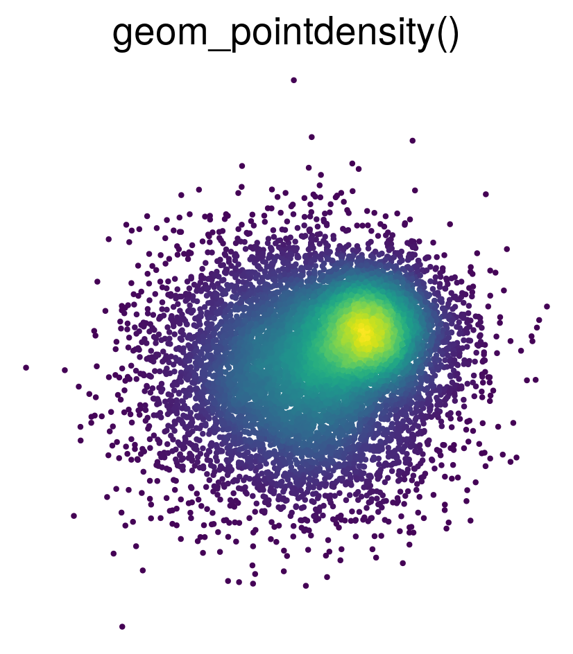
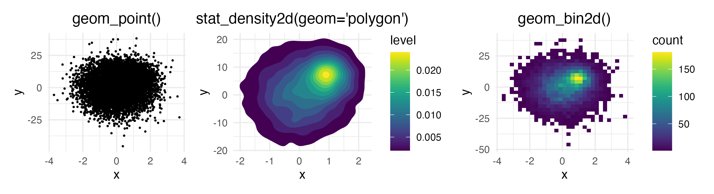
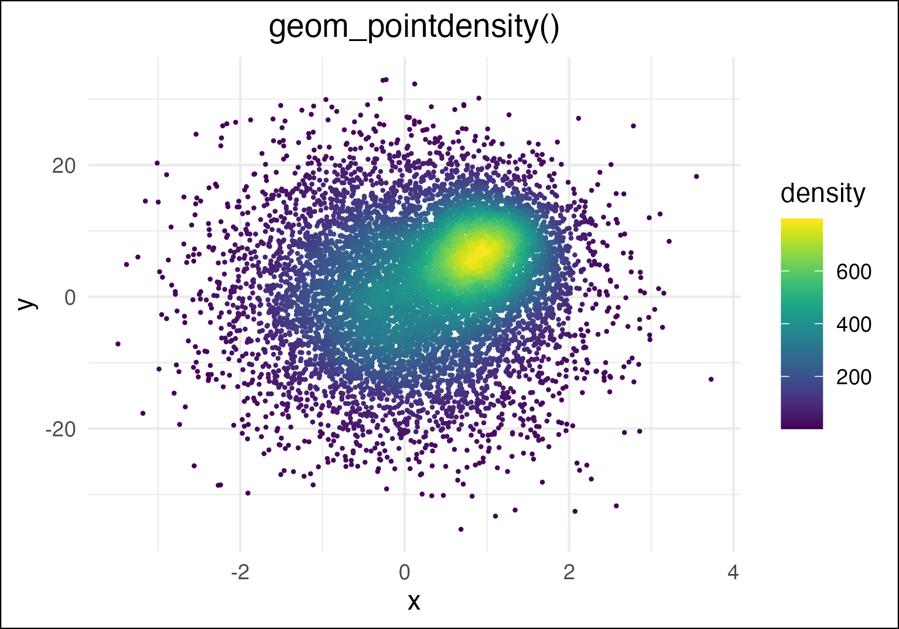
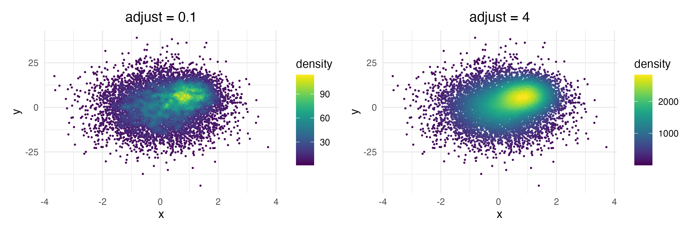
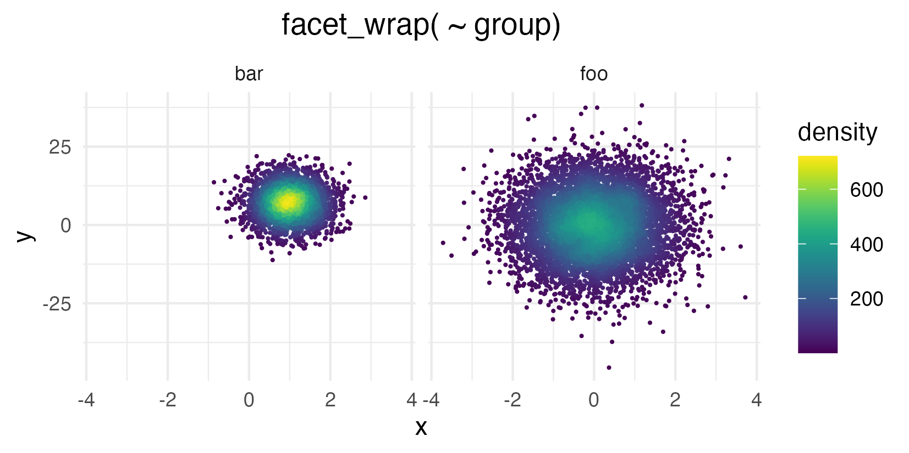
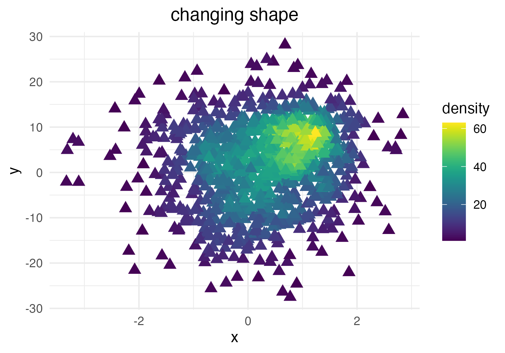
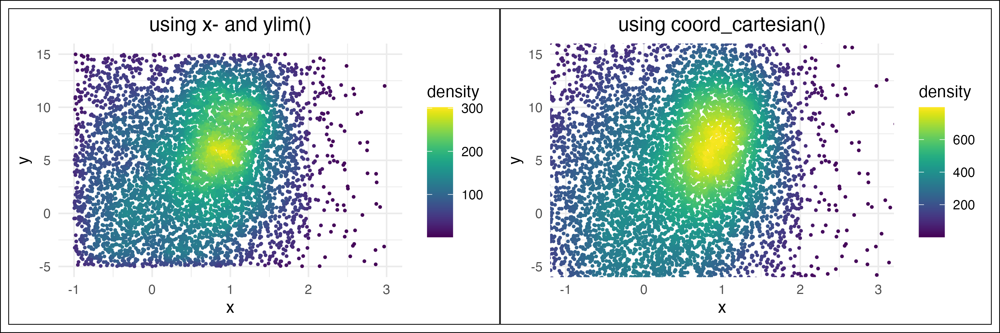
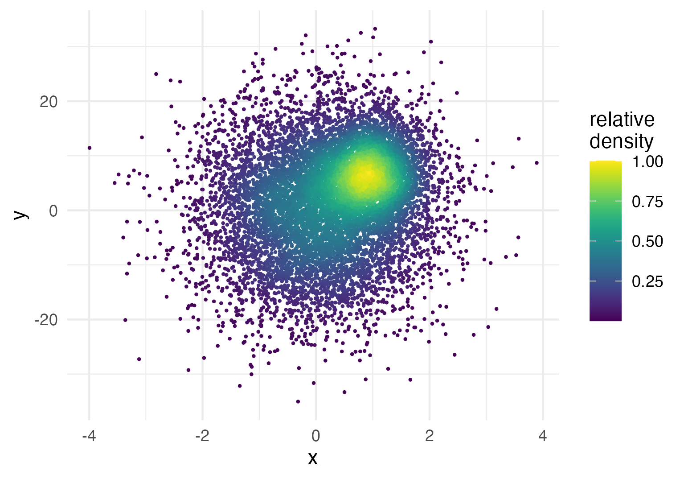
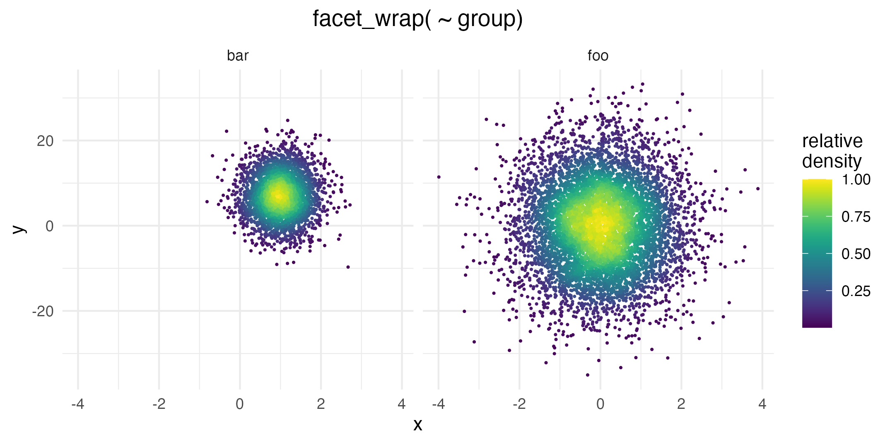
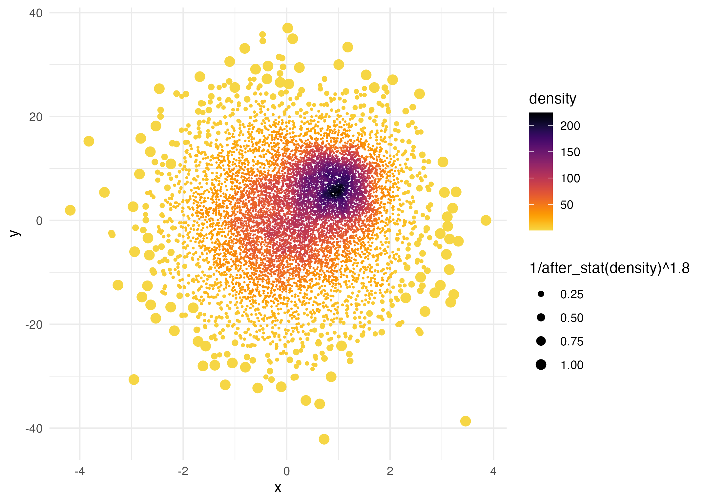

# ggpointdensity
<!-- badges: start -->
[](https://github.com/LKremer/ggpointdensity/actions/workflows/check-standard.yaml)
[](https://cran.r-project.org/package=ggpointdensity) 
[](https://cran.r-project.org/package=ggpointdensity)
<!-- badges: end -->

Introduces `geom_pointdensity()`: A cross between a scatter plot and a 2D density plot.




## Installation
To install the package, type this command in R:
``` r
install.packages("ggpointdensity")

# Alternatively, you can install the latest
# development version from GitHub:
if (!requireNamespace("devtools", quietly = TRUE))
    install.packages("devtools")
devtools::install_github("LKremer/ggpointdensity")
```

## Motivation
There are several ways to visualize data points on a 2D coordinate system:
If you have lots of data points on top of each other, `geom_point()` fails to
give you an estimate of how many points are overlapping.
`geom_density2d()` and `geom_bin2d()` solve this issue, but they make it impossible
to investigate individual outlier points, which may be of interest.



`geom_pointdensity()` aims to solve this problem by combining the best of both
worlds: individual points are colored by the number of neighboring points.
This allows you to see the overall distribution, as well as individual points.



## Demo
Generate some toy data and visualize it with `geom_pointdensity()`:
``` r
library(ggplot2)
library(dplyr)
library(viridis)
library(ggpointdensity)

dat <- bind_rows(
  tibble(x = rnorm(7000, sd = 1),
         y = rnorm(7000, sd = 10),
         group = "foo"),
  tibble(x = rnorm(3000, mean = 1, sd = .5),
         y = rnorm(3000, mean = 7, sd = 5),
         group = "bar"))

ggplot(data = dat, mapping = aes(x = x, y = y)) +
  geom_pointdensity() +
  scale_color_viridis()
```


Each point is colored according to the number of neighboring points.
The distance threshold to consider two points as neighbors (smoothing
bandwidth) can be adjusted with the `adjust` argument, where `adjust = 0.5`
means use half of the default bandwidth.
``` r
ggplot(data = dat, mapping = aes(x = x, y = y)) +
  geom_pointdensity(adjust = .1) +
  scale_color_viridis()
 
ggplot(data = dat, mapping = aes(x = x, y = y)) +
  geom_pointdensity(adjust = 4) +
  scale_color_viridis()
```


Of course you can combine the geom with standard `ggplot2` features
such as facets...

``` r
# Facetting by group
ggplot(data = dat, mapping = aes(x = x, y = y)) +
  geom_pointdensity() +
  scale_color_viridis() +
  facet_wrap( ~ group)
```



... or point shape and size:
``` r
dat_subset <- sample_frac(dat, .1)  # smaller data set
ggplot(data = dat_subset, mapping = aes(x = x, y = y)) +
  geom_pointdensity(size = 3, shape = 17) +
  scale_color_viridis()
```



Zooming into the axis works as well, keep in mind that `xlim()` and
`ylim()` change the density since they remove data points.
It may be better to use `coord_cartesian()` instead.

``` r
ggplot(data = dat, mapping = aes(x = x, y = y)) +
  geom_pointdensity() +
  scale_color_viridis() +
  xlim(c(-1, 3)) + ylim(c(-5, 15))

ggplot(data = dat, mapping = aes(x = x, y = y)) +
  geom_pointdensity() +
  scale_color_viridis() +
  coord_cartesian(xlim = c(-1, 3), ylim = c(-5, 15))
```



### Advanced usage

You can re-use or modify the density estimates using ggplot2's `after_stat()` function.

For instance, let's say you want to plot the density estimates on a *relative* instead of an absolute scale, i.e. scaled from 0 to 1.
Of course this can be achieved by dividing the absolute density values by the maximum, but how do you access the density estimates on R code?
The short answer is to use `after_stat(density)` inside an aesthetics mapping like so:

```r
ggplot(data = dat,
       aes(x = x, y = y, color = after_stat(density / max(density)))) +
  geom_pointdensity(size = .3) +
  scale_color_viridis() +
  labs(color = "relative\ndensity")
```


For a more in-depth explanation on `after_stat()`, check out [the relevant ggplot documentation](https://ggplot2.tidyverse.org/reference/aes_eval.html).

Since plotting the relative density is a common use-case, we provide a little shortcut.
Instead of the solution above you can simply use `after_stat(ndensity)`.
This is especially useful when facetting data, since sometimes you want to inspect the point density separately for each facet:

```r
ggplot(data = dat,
       aes( x = x, y = y, color = after_stat(ndensity))) +
  geom_pointdensity( size = .25) +
  scale_color_viridis() +
  facet_wrap( ~ group) +
  labs(color = "relative\ndensity")
```



Even though the `foo` data group is not as dense as `bar` overall, this plot uses the whole color scale between 0 and 1 in both facets.


Lastly, you can use `after_stat()` to affect other plot aesthetics such as point size:

```r
ggplot(data = dat,
       aes(x = x, y = y, size = after_stat(1 / density ^ 1.8))) +
  geom_pointdensity(adjust = .2) +
  scale_color_viridis() +
  scale_size_continuous(range = c(.001, 3))
```



Here the point size is proportional to `1 / density ^ 1.8`.


## Authors
Lukas PM Kremer ([@LPMKremer](https://x.com/LPMKremer/)) and Simon Anders ([@s_anders_m](https://x.com/s_anders_m/)), 2019
